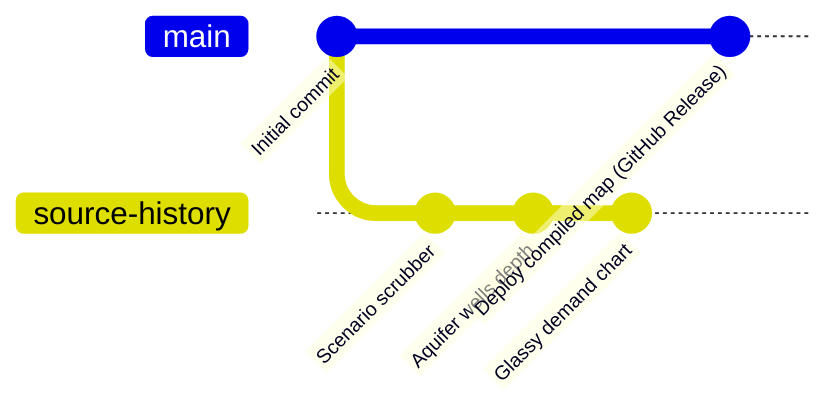

# Git Lessons & Workflow Guide

Welcome to your local Git reference guide! This document is tailored specifically for the **Treasure Valley Grid-Stress Simulator** workspace. It explains your current repository setup and lists the commands you'll need for daily work.

---

## 1. Understanding Our Branch Setup

In your repository at `E:\Workstation_Organized\active_workspace\Treasure_Valley_Model\github_treasure_valley_sim\`, we have structured your branches to keep your work clean:



* **`main` (Active):** This branch tracks `origin/main` on GitHub. It contains the **high-fidelity compiled single-file version** (`index.html` at ~4.1 MB) built by Codex. This is what runs the live interactive map.
* **`source-history`:** This branch contains your **14 source commits** (incremental history, style improvements, individual `.js` files, and logos). It is preserved safely so you never lose the step-by-step history of how the simulator was built.

---

## 2. Daily Git Commands Reference

Here are the primary commands you will use in your terminal (Git Bash, pwsh, or PowerShell):

### Checking Status
Always start by checking where you are and if you have unsaved changes:
```bash
git status
```
*Shows active branch, modified files, and untracked files.*

### Fetching Updates from GitHub
To check if new updates have been pushed to GitHub without modifying your files yet:
```bash
git fetch origin
```

### Pulling (Downloading) GitHub Changes
To download new changes from GitHub and merge them into your active branch:
```bash
git pull origin main
```

### Committing Local Changes
If you modify files locally and want to save them in your history:
1. **Stage the changes:**
   ```bash
   git add index.html
   ```
   *(Or `git add .` to stage all modified files).*
2. **Save with a commit message:**
   ```bash
   git commit -m "Describe your changes here"
   ```

### Pushing Changes to GitHub
To publish your local commits to the online GitHub repository:
```bash
git push origin main
```

---

## 3. Switching Between Branches

To switch between your high-fidelity release branch and your source history branch:

* **Switch to the Compiled Release (`main`):**
  ```bash
  git checkout main
  ```
* **Switch to the Source Code History (`source-history`):**
  ```bash
  git checkout source-history
  ```

---

## 4. Handling Divergences (Forced Updates)

Sometimes, GitHub and your local files will diverge (e.g. if Codex force-pushes a new single-file build). If Git blocks a normal `git pull` or says branches have diverged:

1. **Back up your current branch:**
   ```bash
   git branch -m main old-main-backup
   ```
2. **Get the fresh GitHub release:**
   ```bash
   git fetch origin
   git checkout -b main origin/main
   ```
3. **Delete the old backup (if no longer needed):**
   ```bash
   git branch -D old-main-backup
   ```
